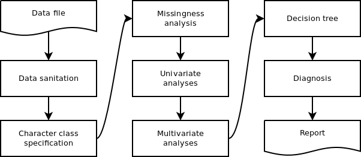

# The data file

# Data sanitation

# Character class specification

Complex characters (color, leaf shape, etc.)

# Missingness analysis

# Univariate analyses

## Histograms

## Violin plots

# Multivariate analyses

In univariate analyses we typically have a great deal of flexibility in how to accomodate data.
For example, data that are distributed in a non-normal manner can be treated with a generalized linear model instead of the standard linear model.
Multivariate analyses typically rely on assumptions of uniformatiy among the characters analysed.
For example, they should all be distributed the same, and this is typically normally distributed.
They also should be scaled in a similar manner.
If one character scales from 2 to 8 and another scales from 2 to 80 the second will be effectively weighted so that it affects the analysis more profoundly than the first.
There are instances where this may be desireable, but typically it is desired that all characters contribute equally.
This means that prior to multivariate analysis we need to carefully screen our data so that we understand its properties and how they may effect the analysis.

## Ordination

## Clustering

# Decision tree

# Diagnosis

